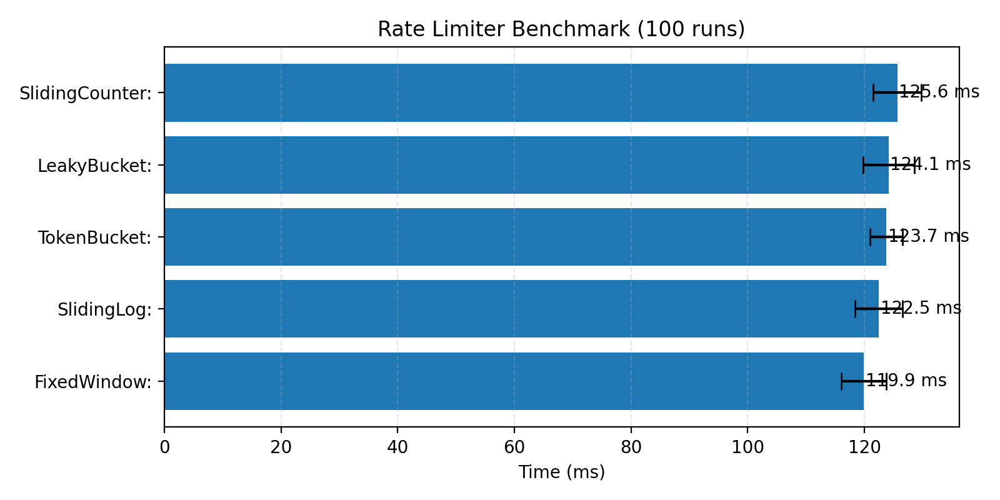

# Ratelimiter

> A rate limiter service built in Rust using multiple algorithms.
> Designed to be fast, modular, scalable and easy to use.

## Algorithms

- [x] Token Bucket Algorithm
- [x] Leaky Bucket Algorithm
- [x] Fixed Window Algorithm
- [x] Sliding Window Log Algorithm
- [x] Sliding Window Counter ALgorithm

## Usage

```bash
cargo run
```

Server runs on `http://localhost:8000`

## Endpoints

- `GET /` - A simple hello world route.
- `GET /unlimited` - An endpoint without any rate limiting.
- `GET /limited/tb` - An endpoint protected by the Token Bucket algorithm.
- `GET /limited/lb` - An endpoint protected by the Leaky Bucket algorithm.
- `GET /limited/fw` - An endpoint protected by the Fixed Window algorithm.
- `GET /limited/swl` - An endpoint protected by the Sliding Window Log algorithm.
- `GET /limited/swc` - An endpoint protected by the Sliding Window Counter algorithm.

## Benchmark



| Algorithm       | Avg Time |
| --------------- | -------- |
| Fixed Window    | ~120 ms  |
| Sliding Log     | ~123 ms  |
| Sliding Counter | ~126 ms  |
| Leaky Bucket    | ~126 ms  |
| Token Bucket    | ~128 ms  |

## Notes

* All algorithms have similar runtime cost
* Differences come from fairness and memory usage

## Conclusion

* Token Bucket / Sliding Counter → best tradeoff
* Fixed Window → fastest but bursty
* Sliding Log → accurate but higher memory
